# :notes: Music Database :notes:

## Autores:

- **José Miguel Hernández Santana**  
  *(alu0101101507@ull.edu.es)*  

- **Ibai Heras Rodrigalvarez**  
  *(alu0101767611@ull.edu.es)*  

- **Mikel Mugica Arregui**  
  *(alu0101773780@ull.edu.es)*

## :dizzy: Introducción

Este proyecto consiste en una base de datos de música utilizando PostgreSQL. La base de datos está diseñada para almacenar información sobre artistas, álbumes, canciones y géneros musicales. Proporciona una estructura organizada y eficiente para gestionar grandes volúmenes de datos musicales y realizar consultas complejas.

## :spiral_notepad: Documentación del Proyecto

Para ver la documentación del proyecto y todas las relaciones de clases en la página web, entra aquí:

`https://dbdocs.io/mikelmujika16/MusicDB`

## :bar_chart: Modelo Entidad-Relación

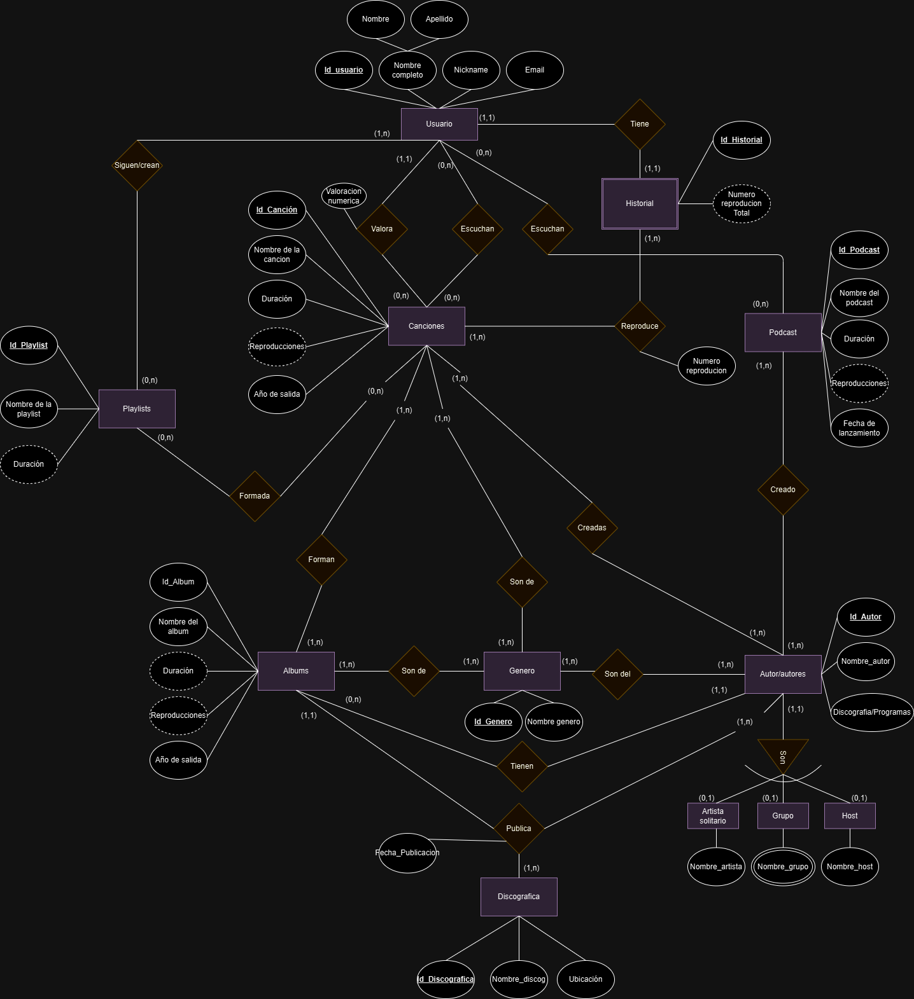

## :bar_chart: Modelo Relacional

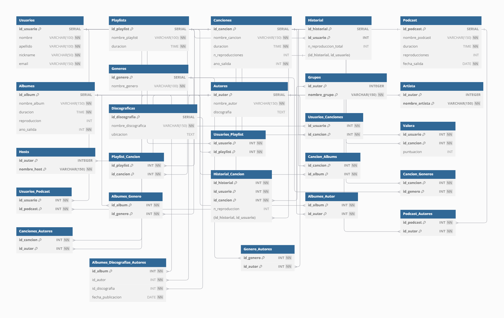

## :hammer_and_wrench: Requisitos del Proyecto

Para ejecutar este proyecto, necesitas tener instalados los siguientes requisitos:

- **Docker**: Para crear y gestionar contenedores.
- **Docker Compose**: Para orquestar los contenedores Docker.
- **Python 3.9**: Para ejecutar la aplicación Flask.
- **PostgreSQL**: Base de datos utilizada en el proyecto.

### Dependencias de Python

Las dependencias de Python necesarias para este proyecto están listadas en el archivo `requirements.txt`:

```plaintext
Flask==2.0.3
SQLAlchemy==1.4.22
psycopg2-binary==2.9.1
Flask-Migrate==3.1.0
Flask-SQLAlchemy==2.5.1
python-dotenv==0.19.1
```

### Variables de Entorno

Asegúrate de tener un archivo 

.env

 con las siguientes variables de entorno:

```plaintext
POSTGRES_DB=music_db
POSTGRES_USER=postgres
POSTGRES_PASSWORD=admin
DB_HOST=db
```

## :rocket: Guía de Instalación

### (Opcion 1) Instalación de la Base de Datos en PostgreSQL

1. **Instalar PostgreSQL**:
   - Descarga e instala PostgreSQL desde [aquí](https://www.postgresql.org/download/).

2. **Crear la base de datos y el usuario**:
   - Abre la terminal de PostgreSQL (psql) y ejecuta los siguientes comandos:

   ```sql
   CREATE DATABASE music_db;
   CREATE USER postgres WITH ENCRYPTED PASSWORD 'admin';
   GRANT ALL PRIVILEGES ON DATABASE music_db TO postgres;
   ```

3. **Importar el archivo SQL**:
   - Ejecuta el siguiente comando en la terminal para importar el archivo `Music Database.sql`:

   ```sh
   psql -U postgres -d music_db -f "ruta/a/tu/archivo/Music Database.sql"
   ```

### (Opcion 2) Despliegue con Docker para API REST

1. **Clonar el repositorio**:

   ```sh
   git clone https://github.com/mikelmujika16/MusicDatabase
   cd MusicDatabase
   cd app
   ```

2. **Construir y ejecutar los contenedores Docker**:

   ```sh
   docker-compose up --build
   ```

3. **Acceder a la aplicación**:

   Abre tu navegador web y ve a `http://localhost:5000`.

Con estos pasos, deberías poder instalar la base de datos en PostgreSQL o desplegar la aplicación utilizando Docker Compose. 

## :white_check_mark: Imagenes del correcto funcionamiento del código SQL

Para realizar consultas de prueba, eliminaciones y actualizaciones en las diferentes tablas creadas en `Music Database.sql`, y reflejar casos de disparadores, aserciones y checks, puedes seguir los siguientes ejemplos:

### Consultas de Prueba

#### Consultar todos los usuarios

```sql
SELECT * FROM Usuarios;
```

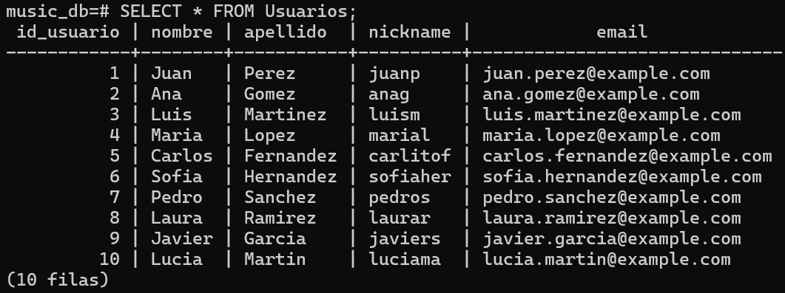

#### Consultar todas las canciones

```sql
SELECT * FROM Canciones;
```

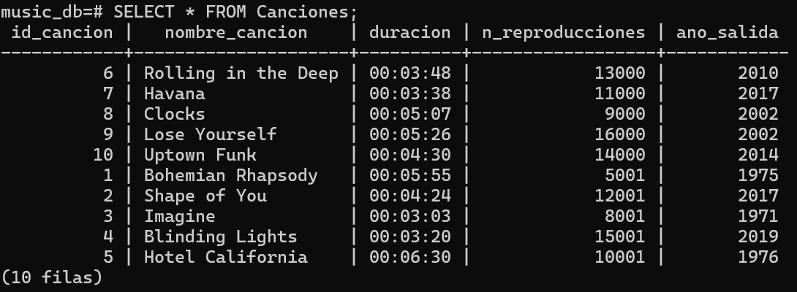

#### Consultar todas las playlists

```sql
SELECT * FROM Playlists;
```

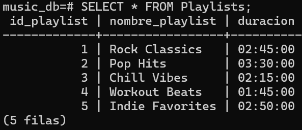

### Inserciones de Prueba

#### Insertar un nuevo usuario

```sql
INSERT INTO Usuarios (nombre, apellido, nickname, email) 
VALUES ('Carlos', 'Lopez', 'carlitos', 'carlos.lopez@example.com');
```

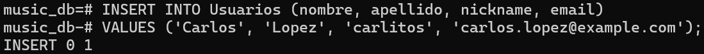

#### Insertar una nueva cancion

```sql
INSERT INTO Canciones (nombre_cancion, duracion, n_reproducciones, ano_salida) VALUES ('Nueva Cancion', '03:45', 0, 2023);
```

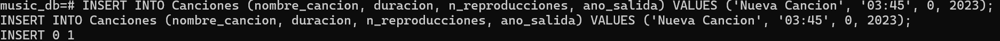

#### Insertar un nuevo autor y asociarlo a un grupo

```sql
INSERT INTO Autores (nombre_autor, discografia) 
VALUES ('Nuevo Autor', 'Discografia del nuevo autor');

INSERT INTO Grupos (id_autor, nombre_grupo) 
VALUES ((SELECT id_autor FROM Autores WHERE nombre_autor = 'Nuevo Autor'), 'Nuevo Grupo');
```

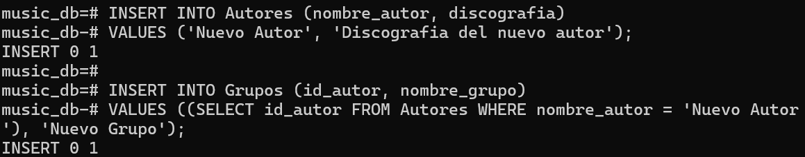

### Actualizaciones de Prueba

#### Actualizar el nombre de un usuario

```sql
UPDATE Usuarios 
SET nombre = 'julen' 
WHERE nickname = 'juanp';
```

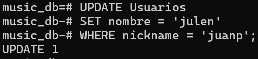

#### Actualizar el nombre de una canción

```sql
UPDATE Canciones 
SET nombre_cancion = 'Cancion Actualizada' 
WHERE nombre_cancion = 'Nueva Cancion';
```

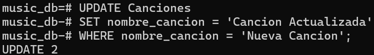

### Eliminaciones de Prueba

#### Eliminar un usuario

```sql
DELETE FROM Usuarios 
WHERE nickname = 'carlitos';
```

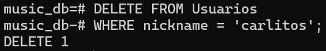

#### Eliminar una canción

```sql
DELETE FROM Canciones 
WHERE nombre_cancion = 'Cancion Actualizada';
```

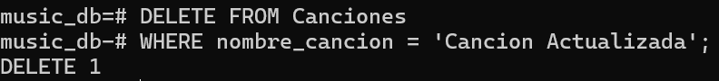

### Casos de Disparadores, Aserciones y Checks

#### Insertar un autor que ya es un host (debería activar el disparador y lanzar una excepción)

```sql
-- Primero, insertar un autor y hacerlo host
INSERT INTO Autores (nombre_autor, discografia) 
VALUES ('Autor Host', 'Discografia del autor host');

INSERT INTO Hosts (id_autor, nombre_host) 
VALUES ((SELECT id_autor FROM Autores WHERE nombre_autor = 'Autor Host'), 'Host Autor');
```

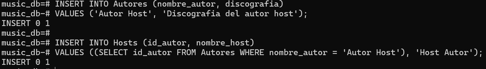

```sql
-- Intentar insertar el mismo autor en la tabla Grupos (debería fallar)
INSERT INTO Grupos (id_autor, nombre_grupo) 
VALUES ((SELECT id_autor FROM Autores WHERE nombre_autor = 'Autor Host'), 'Grupo del Autor Host');
```


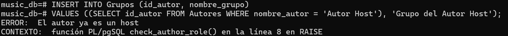

#### Insertar una canción con duración negativa (debería fallar por el check)

```sql
INSERT INTO Canciones (nombre_cancion, duracion, n_reproducciones, ano_salida) 
VALUES ('Cancion Invalida', '-03:45', 0, 2023);
```


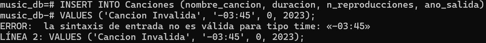

#### Actualizar el número de reproducciones de una canción a un valor negativo (debería fallar por el check)

```sql
UPDATE Canciones 
SET n_reproducciones = -10 
WHERE nombre_cancion = 'Nueva Cancion';
```

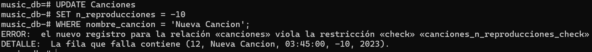


Estos ejemplos cubren inserciones, actualizaciones y eliminaciones en las tablas, así como casos que deberían activar disparadores, aserciones y checks definidos en tu base de datos.


### :money_with_wings: Presupuesto del Proyecto

El presupuesto del proyecto se ha estimado teniendo en cuenta los siguientes factores, adaptados a un proyecto universitario:

1. **Desarrollo de Software**:
   - **Desarrolladores**: 3 estudiantes trabajando a tiempo parcial (20 horas/semana) durante 3 meses.

2. **Infraestructura**:
   - **Servidores en la nube**: Uso de servicios gratuitos o de bajo costo (por ejemplo, AWS Free Tier, Heroku Free Plan).

3. **Licencias y Herramientas**:
   - **Licencias de software**: Uso de herramientas y software gratuitos o con descuentos para estudiantes.

4. **Pruebas y QA**:
   - **Ingenieros de QA**: 1 estudiante trabajando a tiempo parcial (20 horas/semana) durante 2 meses.

5. **Marketing y Publicidad**:
   - **Promoción en redes sociales**: Uso de plataformas gratuitas y redes sociales para la promoción.

6. **Contingencias**:
   - **Imprevistos y contingencias**: 5% del presupuesto total.

### Detalle del Presupuesto

| Concepto                          | Cantidad | Costo Unitario | Total       |
|-----------------------------------|----------|----------------|-------------|
| Desarrolladores                   | 3        | $10/hora       | $7,200      |
| Servidores en la nube             | 3 meses  | $20/mes        | $60         |
| Licencias de software             | -        | -              | $0          |
| Herramientas de desarrollo        | -        | -              | $0          |
| Ingenieros de QA                  | 1        | $10/hora       | $1,600      |
| Promoción en redes sociales       | -        | -              | $0          |
| Imprevistos y contingencias (5%)  | -        | -              | $440        |
| **Total**                         |          |                | **$9,300**  |

### Justificación del Presupuesto

- **Desarrollo de Software**: La mayor parte del presupuesto se destina al desarrollo de software, con estudiantes trabajando a tiempo parcial, lo que reduce significativamente los costos.
- **Infraestructura**: Se ha presupuestado el uso de servicios en la nube gratuitos o de bajo costo para minimizar los gastos.
- **Licencias y Herramientas**: Se utilizarán herramientas y software gratuitos o con descuentos para estudiantes, eliminando así estos costos.
- **Pruebas y QA**: Se ha asignado un presupuesto para un estudiante que realice pruebas y asegure la calidad del software.
- **Marketing y Publicidad**: Se utilizarán plataformas gratuitas y redes sociales para la promoción del proyecto, eliminando así estos costos.
- **Contingencias**: Se ha añadido un 5% del presupuesto total para cubrir cualquier imprevisto o gasto adicional que pueda surgir durante el desarrollo del proyecto.

Este presupuesto es una estimación y puede variar en función de las necesidades específicas y los cambios en el alcance del proyecto.
